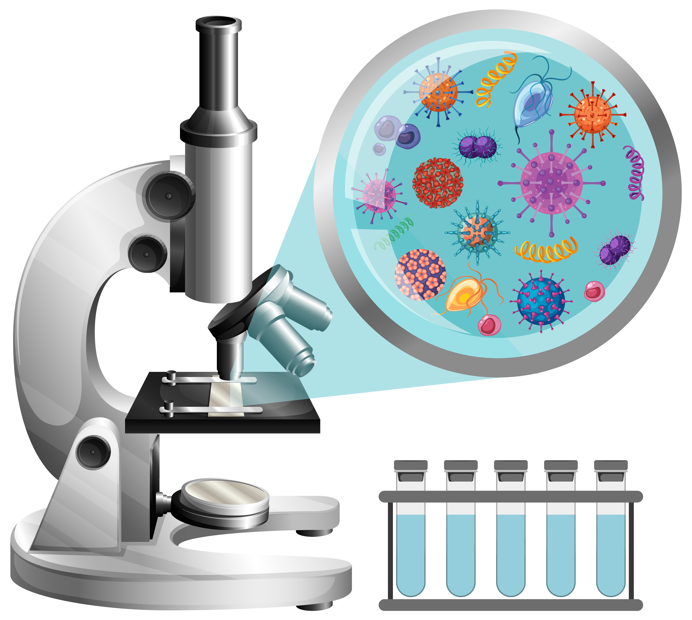
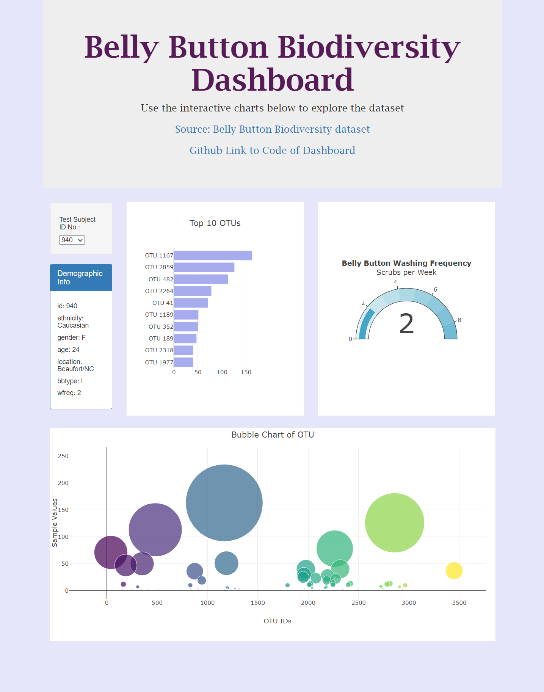

# Belly Button Biodivesity Dashboard

## Overview
The Belly Button Biodiversity Dashboard is an interactive web application that allows users to explore the microbes that colonize human navels. The dataset used in the dashboard catalogs operational taxonomic units (OTUs) present in human navels, with some being common in the majority of people and others being relatively rare. The dashboard provides visualizations in the form of horizontal bar charts, bubble chart, gauage meter, as well as demographic information for each selected individual.

##  Demo
You can access the live demo of the [Belly Button Biodiversity Dashboard here](https://jnliou.github.io/belly-button-challenge/Code/index.html).

## Features
JavaScript code found: [app.js](Code/static/js/app.js)

* Dropdown Menu: Users can select a specific individual from the dropdown menu to view their OTUs and demographic information.

* Horizontal Bar Chart: Displays the top 10 OTUs found in the selected individual, with sample values as bar heights, OTU IDs as labels, and OTU labels as hovertext.

* Bubble Chart: Visualizes the distribution of microbial species in the selected individual, with OTU IDs on the x-axis, sample values on the y-axis, marker size representing sample values, marker colors representing OTU IDs, and text labels showing OTU labels.

* Gauge Meter: Gauage meter of of hand washing frequency. 

* Sample Metadata: Displays demographic information for the selected individual, including key-value pairs from the metadata JSON object.

* Dynamic Updates: All plots and metadata display are automatically updated when a new sample is selected from the dropdown.

## Installation
* Clone this repository to your local machine using git clone.
* Navigate to the project directory.
* Open the [index.html](Code/index.html) file in your web browser.
## Usage
* Open the Belly Button Biodiversity Dashboard in your web browser.
* Use the dropdown menu to select an individual's ID.
* Explore the bar chart and bubble chart to understand the distribution of microbial species for the selected individual.
* View the sample metadata displayed on the page.
## Technologies Used
* HTML
* CSS
* JavaScript
* D3.js (Data-Driven Documents)
# Data Source
The data used in this project is obtained from the following URL: 
* [Belly Button Biodiversity Dataset](http://robdunnlab.com/projects/belly-button-biodiversity/ )
* [JSON URL of Data](https://2u-data-curriculum-team.s3.amazonaws.com/dataviz-classroom/v1.1/14-Interactive-Web-Visualizations/02-Homework/samples.json)
* [Data from Local Source](Code/data/samples.json)

